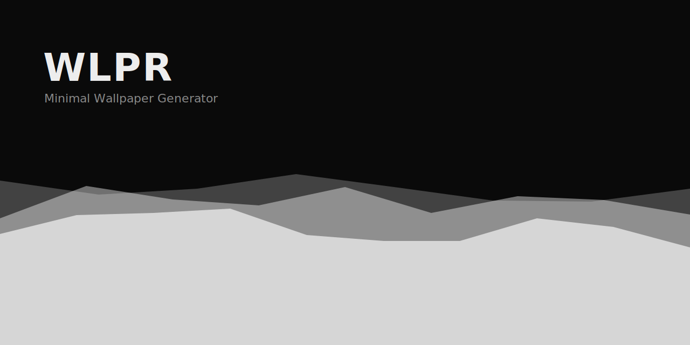
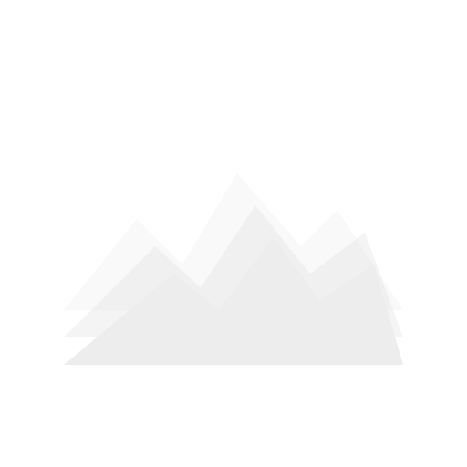

<p align="center">
  
</p>

<p align="center">
  
</p>

# WLPR — Minimal Wallpaper Generator

A small wallpaper generator I built because I wanted something minimal, procedural, and mine — not another site full of stock gradients. Pick a pattern, pick a palette, hit shuffle until something clicks, then download it in whatever resolution you need.

Everything renders live in the browser with Canvas. No accounts, no server, no tracking. Every wallpaper you make has a seed baked into the URL, so if you land on one you like you can just bookmark or share the link and get the exact same image back.

Live at: https://aaryanraj007.github.io/WLPR/

## What it does

- 7 procedural patterns: Ridgeline (mountain silhouettes), Horizon (banded sunset gradients), Flow Field (generative line art), Dunes (sand waves), Topographic Line Art (contour elevation maps), Connected Squares (corner-to-corner lattice), and Curved Waves (minimal lower-horizon curves)
- 7 curated color palettes (Mono, Cream, Slate, Forest, Amber, Violet, Rust) built on OKLCH
- Universal **Invert** toggle switch to flip background and element colors instantly across every pattern
- A dark/light toggle that changes the mood of the wallpaper, not just the site
- A "Customize" panel with per-pattern sliders (layer count, roughness/warp/density depending on the pattern) plus a visible seed you can copy or type back in
- Optional grain overlay for texture
- Shuffle regenerates the shape/seed while keeping your palette and pattern choice
- Export at a bunch of common sizes (4K, 2K, 1080p, iPhone, or match your own screen), rendered off the main thread in a Web Worker so the UI never freezes
- Your last session is remembered (localStorage) and also encoded into the URL hash, so refreshing or sharing a link both just work

## Stack

Vanilla TypeScript + Vite. No UI framework — the whole thing is one render loop drawing onto a couple of canvases, so there's no reason to pay for a framework's overhead. Color math runs through [culori](https://culorijs.org/) for OKLCH, noise comes from [simplex-noise](https://github.com/jwagner/simplex-noise.js), and randomness is a seeded mulberry32 PRNG so everything is reproducible from a seed string.

## Running it locally

```bash
npm install
npm run dev
```

That starts Vite on localhost. Build for production with:

```bash
npm run build
```

Output goes to `dist/`, which is a fully static folder — you can host it anywhere.

## Deployment

This repo deploys itself to GitHub Pages via the workflow in `.github/workflows/deploy.yml` — push to `main` and it builds and publishes automatically. If you're forking this: go to the repo's Settings → Pages and set the source to "GitHub Actions" once, and it'll take care of itself after that.

## Why it looks like this

Loosely inspired by [WLLPR](https://bypedroneres.github.io/wllpr-website/), a native wallpaper app with a similar dark-minimal aesthetic. That one's a downloadable desktop app though — this is the web version I wished existed, built from scratch with its own pattern engine.

## Roadmap-ish

Things I might add later: more patterns (contour lines, low-poly, dot fields), saved custom palettes, and eventually wrapping this as an Android app with Capacitor so it can save straight to your gallery.
